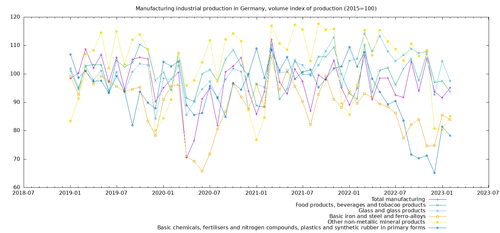

# Collection of eurostat graphs

Collection of scripts to automatically download data though the eurostat api
and plot it into graphs.

## German industry

Plots the volume output of certain highly energy dependant german industries.

Usage :
```
chmod +x wget_germany.sh
./wget_germany.sh
gnuplot -p plot.gnu
```

Ouput :


